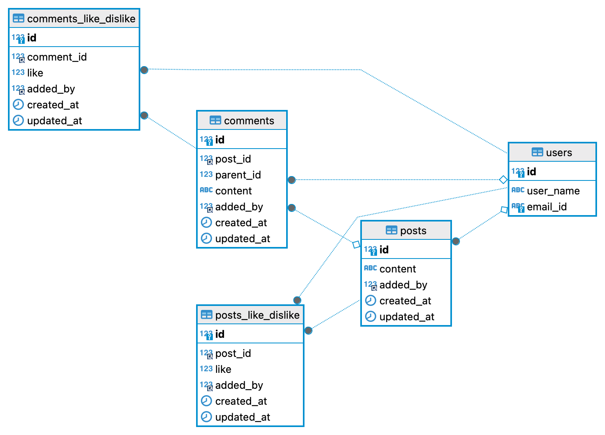

# Social Media Service

# Purpose
Comment service responsibility is to create a social media basic APIs wherre users can register themselves, create a post, comment on a post, reply on a post and react to a comment.

# Delieverables
1. Design a basic service which can add comments, likes, dislikes to a social media post, replies to a comment, replies to replies and associated likes or dislikes.
2. There should be a get api to satisfy the requirements. The API shall be scalable for a service where there can be 1000s of comments and each of the comment having 100s of levels.
3. API design, Database design, relationship between entities, class design, pagination concepts.
4. REST API’s endpoints and integration to connect back end system
5. Test Cases setup and unit test coverage

# Frameworks and library used
1. Java 
2. Spring Boot
3. MySql (RDBMS)

# ER Diagram


# APIs Used
1. Check server status
```
curl --location 'http://localhost:8080/sanity'
```
Response
```
{
"status": "Service is up and running"
}
```

2. Register a user
```
curl --location 'http://localhost:8080/user' \
--header 'Content-Type: application/json' \
--data-raw '{
    "userName": "test123456",
    "emailId": "nitya@gmail.com"
}'
```

Response
```
{
    "message": "User added successfully"
}
```

3. Create a post
```
curl --location 'http://localhost:7777/api/v1/post' \
--header 'Content-Type: application/json' \
--data '{
    "userId": 1,
    "content": "Welcome to my account post 2"
}'
```
Response
```
{
    "message": "Post added successfully"
}
```

4. Comment on a post
```
curl --location 'http://localhost:8080/api/v1/post/1/comment' \
--header 'Content-Type: application/json' \
--data '{
    "userId": 17,
    "comment": "I have commented on your post"
}'
```

5. React on a post
```
curl --location --request PUT 'http://localhost:8080/api/v1/post/1/react' \
--header 'Content-Type: application/json' \
--data '{
    "userId" : 1,
    "reactType" : 1
}'
```
6. React on a comment
```
curl --location --request PUT 'http://localhost:8080/api/v1/comment/1/react' \
--header 'Content-Type: application/json' \
--data '{
    "userId": 1,
    "reactType": 1
}'
```

7. Comment on a comment
```
curl --location 'http://localhost:8080/api/v1/comment/2/comment' \
--header 'Content-Type: application/json' \
--data '{
    "userId": 17,
    "postId": 2,
    "comment": "replied on comment 1"
}'
```

8. Get details of a post
```
curl --location 'http://localhost:8080/api/v1/post/1'
```

9. Get N First Level Comments of a post
```
curl --location 'http://localhost:8080/api/v1/post/1/comments?pageSize=2&pageNo=3'
```

10. Get replies on a comment
```
curl --location 'http://localhost:8080/api/v1/comment/2/replies?pageSize=1&pageNo=1'
```

11. Get users who liked/disliked the post
```
curl --location 'http://localhost:8080/api/v1/post/1/react/1/users'
```

12. Get users whole liked/disliked the comment
```
curl --location 'http://localhost:8080/api/v1/comment/1/react/1/users'
```


